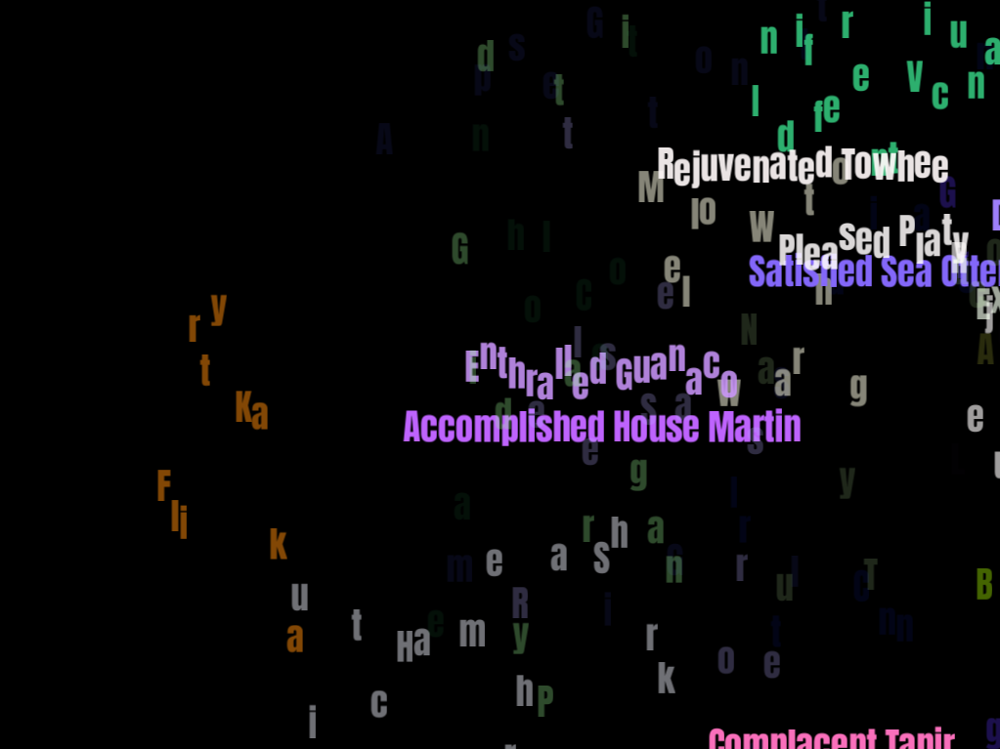

[](https://github.com/shampoofactory/moody_animals/actions)

# moody_animals
Simple OpenGL bitmap font demo.
Created to test [bmfont_rs](https://github.com/shampoofactory/bmfont_rs) in a standalone application.



## Build

Build requirements:
- OpenGL 3.3 or higher.
- SDL2 dev libraries, install guide [here](https://github.com/Rust-SDL2/rust-sdl2#sdl20-development-libraries).

Then:
```
$ cargo build --release
```

The binary is located at
```
$ target/release/moody_animals --help
```

## Run

Run windowed:
```
$ moody_animals
```

Run full screen:
```
$ moody_animals -f
```

Run full screen with settings:
```
$ moody_animals -f -s 90 -d 80
```

Help file:

```
$ moody_animals --help
moody_animals 0.1.0
Vin Singh <github.com/shampoofactory>
Simple OpenGL bitmap font demo

USAGE:
    moody_animals [FLAGS] [OPTIONS]

FLAGS:
    -f, --fullscreen    fullscreen, overrides width/ height
        --help          Prints help information
    -V, --version       Prints version information

OPTIONS:
    -d, --density <PERCENT>    word density [default: 5]
    -h, --height <PIXELS>      screen height [default: 768]
    -s, --speed <PERCENT>      animation speed [default: 70]
    -w, --width <PIXELS>       screen width [default: 1024]
```

Alternatively, run with cargo and pass any flags after `--`:
```
$ cargo run -- --help
```

## License

Licensed under either of

 * Apache License, Version 2.0
   ([LICENSE-APACHE](LICENSE-APACHE) or http://www.apache.org/licenses/LICENSE-2.0)
 * MIT license
   ([LICENSE-MIT](LICENSE-MIT) or http://opensource.org/licenses/MIT)

at your option.
